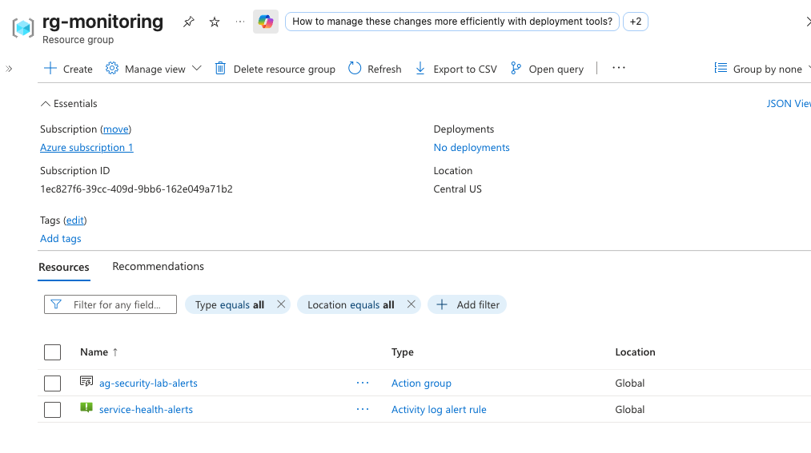

# azure-security
End-to-end Azure security modules: Deployed via Terraform, Defender for Cloud, KQL detection, and remediated through infrastructure as code.

## Documentation
- [Troubleshooting log](docs/troubleshooting.md)

## Modules

### Monitoring Module

The monitoring module provides subscription-wide cost and service health oversight, deployed independently from the lab infrastructure so it survives `terraform destroy` cycles on the resources being tested.

**What it deploys:**
- **Action Group** (`ag-security-lab-alerts`) — a shared notification channel that routes alerts to email. Referenced by both the budget and service health alerts below, so any future alert can reuse it rather than duplicating notification config.
- **Consumption Budget** — a subscription-level budget with alert thresholds at 80% and 100% of a configurable monthly amount, notifying via the action group before spend gets out of hand.
- **Service Health Alert** (`service-health-alerts`) — watches for Azure platform incidents and planned maintenance events affecting the subscription, separate from monitoring the lab's own resources.

**Design decisions:**
- Deployed into its own resource group (`rg-monitoring`), isolated from the lab's resource group (`rg-azure-security`) — this means the lab environment can be torn down and rebuilt between sessions without losing budget/health alerting
- Scoped to the entire subscription rather than a single resource group, so it catches spend and health issues regardless of what gets built next in this project

*Action group and service health alert rule deployed to `rg-monitoring`, confirmed via Azure portal.*

### Static Web App Module

Brings the existing, already-live portfolio site (`omardevsec.pro`) under Terraform management via `terraform import`, rather than redeploying it from scratch — this preserves the live site, its GitHub Actions deployment pipeline, and its history.

**What it manages:**
- `azurerm_static_web_app` resource, imported from an existing Static Web App originally created manually in the Azure portal
- Tags (`PersonalSite = "1"`) brought into the config to match the real resource exactly, avoiding drift

**Design decision — resource type migration:**
The original plan used `azurerm_static_site`, but the first `terraform plan` after import surfaced a deprecation warning: `azurerm_static_site` is deprecated in favor of `azurerm_static_web_app` and will be removed in a future provider release. Since this was still early in bringing the resource under management, the resource type was migrated immediately rather than building on a deprecated type.

### Storage Module

Deploys a private-by-default storage account and blob container, intended later as the target for a deliberate misconfiguration in Phase 3 (e.g. public blob exposure or SAS token abuse).

**What it deploys:**
- **Storage Account** — `Standard` tier, `LRS` replication (cheapest option, appropriate for a lab environment that gets torn down between sessions)
- **Blob Container** — private access by default

**Security baseline set at creation:**
- `https_traffic_only_enabled = true` — rejects unencrypted HTTP connections
- `allow_nested_items_to_be_public = false` — account-level control blocking public blob access even if a container's access type is later misconfigured (defense in depth)
- `container_access_type = "private"` — no anonymous read access

This "secure by default" baseline is intentional — Phase 3 will deliberately weaken specific settings here to simulate a real misconfiguration, then Phase 4 will detect and remediate it back to this state via Terraform.