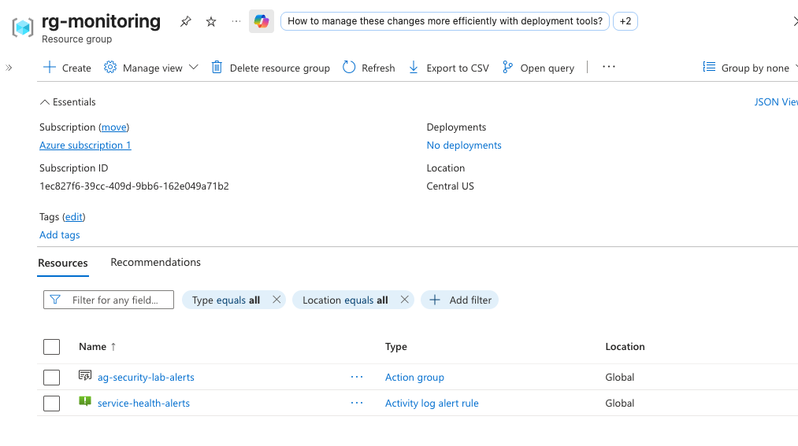
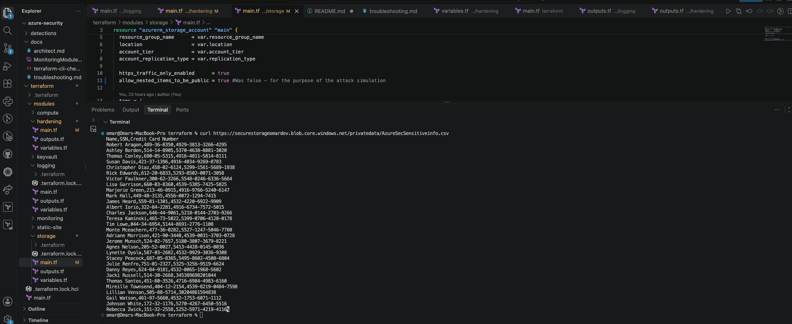
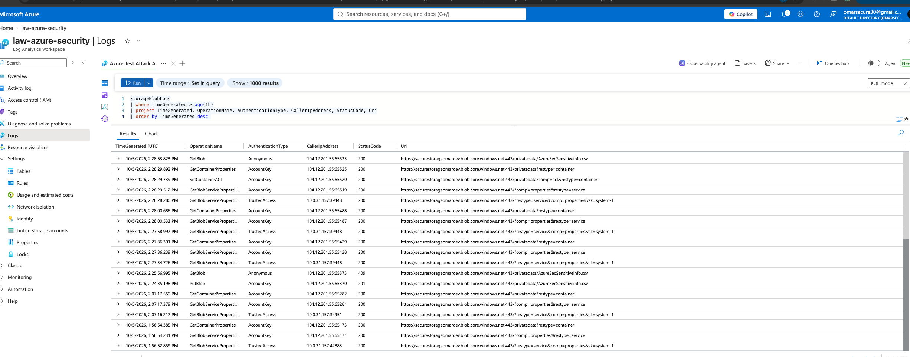
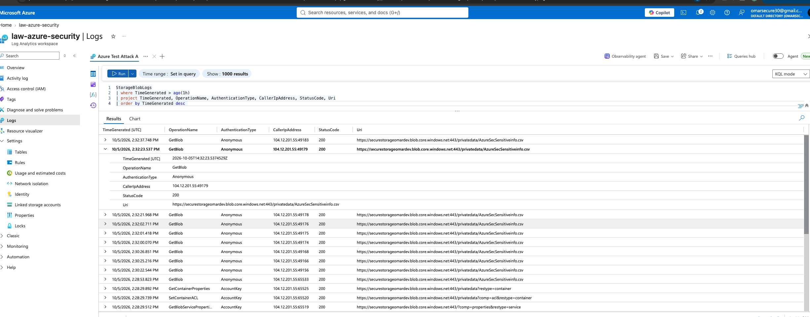

# azure-security
End-to-end Azure security modules: Deployed via Terraform, Defender for Cloud, KQL detection, and remediated through infrastructure as code.

## Documentation
- [Troubleshooting log](docs/troubleshooting.md)

## Modules

### Monitoring Module

The monitoring module provides subscription-wide cost and service health oversight, deployed independently from the lab infrastructure so it survives `terraform destroy` cycles on the resources being tested.

**What it deploys:**
- **Action Group** (`ag-security-lab-alerts`) — a shared notification channel that routes alerts to email. Referenced by both the budget and service health alerts below, so any future alert can reuse it rather than duplicating notification config.
- **Consumption Budget** — a subscription-level budget with alert thresholds at 80% and 100% of a configurable monthly amount, notifying via the action group before spend gets out of hand.
- **Service Health Alert** (`service-health-alerts`) — watches for Azure platform incidents and planned maintenance events affecting the subscription, separate from monitoring the lab's own resources.

**Design decisions:**
- Deployed into its own resource group (`rg-monitoring`), isolated from the lab's resource group (`rg-azure-security`) — this means the lab environment can be torn down and rebuilt between sessions without losing budget/health alerting
- Scoped to the entire subscription rather than a single resource group, so it catches spend and health issues regardless of what gets built next in this project

*Action group and service health alert rule deployed to `rg-monitoring`, confirmed via Azure portal.*

### Static Web App Module

Brings the existing, already-live portfolio site (`omardevsec.pro`) under Terraform management via `terraform import`, rather than redeploying it from scratch — this preserves the live site, its GitHub Actions deployment pipeline, and its history.

**What it manages:**
- `azurerm_static_web_app` resource, imported from an existing Static Web App originally created manually in the Azure portal
- Tags (`PersonalSite = "1"`) brought into the config to match the real resource exactly, avoiding drift

**Design decision — resource type migration:**
The original plan used `azurerm_static_site`, but the first `terraform plan` after import surfaced a deprecation warning: `azurerm_static_site` is deprecated in favor of `azurerm_static_web_app` and will be removed in a future provider release. Since this was still early in bringing the resource under management, the resource type was migrated immediately rather than building on a deprecated type.

### Storage Module

Deploys a private-by-default storage account and blob container, intended later as the target for a deliberate misconfiguration in Phase 3 (e.g. public blob exposure or SAS token abuse).

**What it deploys:**
- **Storage Account** — `Standard` tier, `LRS` replication (cheapest option, appropriate for a lab environment that gets torn down between sessions)
- **Blob Container** — private access by default

**Security baseline set at creation:**
- `https_traffic_only_enabled = true` — rejects unencrypted HTTP connections
- `allow_nested_items_to_be_public = false` — account-level control blocking public blob access even if a container's access type is later misconfigured (defense in depth)
- `container_access_type = "private"` — no anonymous read access

This "secure by default" baseline is intentional — Phase 3 will deliberately weaken specific settings here to simulate a real misconfiguration, then Phase 4 will detect and remediate it back to this state via Terraform.

### Key Vault Module
 
Deploys an Azure Key Vault using RBAC-based authorization rather than the legacy access-policy model, aligned with Microsoft's current recommended approach for new vaults.
 
**What it deploys:**
- **Key Vault** — `standard` SKU, RBAC authorization enabled, purge protection disabled (appropriate for a lab environment that gets recreated between sessions — production vaults should enable this)
- **Role Assignment** — grants the deploying user the `Key Vault Administrator` role, scoped to this vault, using the signed-in user's object ID read automatically via `data "azurerm_client_config"`
**Design decisions:**
- RBAC over access policies from the start — avoids taking on the legacy model only to migrate away from it later
- `purge_protection_enabled = false` — lets the vault be fully destroyed and recreated during lab iteration; would be flipped to `true` in a production configuration
 
### Logging Module
 
Deploys a Log Analytics workspace that will serve as the central destination for diagnostic settings across every other resource in the project, starting in Phase 2.
 
**What it deploys:**
- **Log Analytics Workspace** — `PerGB2018` SKU (standard pay-as-you-go pricing tier), 30-day retention (the free-included retention period)
**Design decisions:**
- Built before Phase 2's hardening work, since diagnostic settings on storage, Key Vault, and other resources need a workspace to send logs to before they can be configured
- Kept in the lab resource group (`rg-azure-security`) rather than the monitoring resource group — this workspace holds resource-level telemetry tied to the lab environment's lifecycle, distinct from the subscription-wide cost/health alerting in `rg-monitoring`
- Exposes `workspace_id` as a module output so future modules (diagnostic settings in Phase 2, KQL detections in Phase 4) can reference it without a separate lookup

### Compute Module

Deploys the VM that will serve as the Phase 3 attack surface — a full VNet, subnet, NSG, static public IP, NIC, and Ubuntu Linux VM, all provisioned together in one module since they're tightly coupled.

**What it deploys:**
- **Virtual Network** (`10.10.0.0/16`) with a single subnet (`10.10.1.0/24`)
- **Network Security Group** — inbound SSH (port 22) allowed only from a single admin IP (`/32`), deny-by-default for everything else
- **Static Public IP** (Standard SKU)
- **Linux VM** — Ubuntu 22.04 LTS, `Standard_B1s`, SSH-key-only authentication (password auth disabled), RSA key pair required

**Security baseline set at creation:**
- `disable_password_authentication = true` — no password login surface at all
- NSG scoped to a single source IP rather than the internet — this is the control Phase 3 will deliberately weaken (widening to `0.0.0.0/0`) to simulate a real misconfiguration
- RSA key (not ed25519) — required by Azure's VM provisioning agent for the initial SSH key injection

**Region note:** deployed to `denmarkeast`, not the project's default `centralus` — the subscription is restricted from deploying VMs and networking resources into most mainstream regions (see [troubleshooting log](docs/troubleshooting.md)). All six compute resources (VNet, subnet, NSG, NSG association, public IP, NIC, VM) live together in `denmarkeast`; other modules (storage, Key Vault, logging) remain in `centralus`, since a resource group's location does not require every resource inside it to share that region.

**Verified working:** SSH access confirmed from the allowed source IP using the RSA key; VM deallocated (`az vm deallocate`) immediately after verification to stop compute billing while not in active use.

### Hardening Module

Deploys diagnostic settings and Defender for Cloud, wiring every other module's resources into the central Log Analytics workspace built in the Logging module. This is Phase 2's main deliverable — turning on visibility before Phase 3 introduces a deliberate misconfiguration to detect.

**What it deploys:**
- **Diagnostic Settings** — one per monitored resource, each sending logs/metrics to the Log Analytics workspace:
  - **Key Vault** — `AuditEvent` logs, `AllMetrics`
  - **NSG** — `NetworkSecurityGroupEvent` and `NetworkSecurityGroupRuleCounter` logs
  - **Storage Account** — `Transaction` metrics at the account level, plus a separate setting at the blob service sub-resource (`.../blobServices/default/`) for `StorageRead`, `StorageWrite`, and `StorageDelete` logs
- **Defender for Cloud** — Standard tier pricing for VMs, gated behind `var.enable_defender` (default `false`) so it's never turned on — and billing — by accident

**Design decisions:**
- Built as its own module rather than folded into `logging/`, `storage/`, or `keyvault/` — diagnostic settings *point from* other resources *to* the workspace, the reverse dependency direction of the modules that own those resources, so they read cleaner kept separate
- Consumes `storage_account_id`, `key_vault_id`, `nsg_id`, and `log_analytics_workspace_id` as module outputs from Phase 1's modules rather than re-querying Azure with data sources — this is why those outputs existed in advance
- `enable_defender` defaults to `false` since Defender Standard tier is a real ongoing per-VM cost, consistent with the cost-discipline pattern already set by `rg-monitoring`
- No `outputs.tf` — nothing downstream currently consumes a value produced by this module

**Storage Account diagnostic settings — two resources, not one:** Unlike Key Vault and NSG, a storage account's top-level resource only supports *metrics* (`Transaction`, `Capacity`); the actual read/write/delete *log* categories only exist at the blob service sub-resource level. This is why the Storage Account has two separate `azurerm_monitor_diagnostic_setting` resources targeting two different resource IDs, where every other resource in this module needed only one.

# Attack A: Public Blob Exposure (Storage Account)

## Objective

Simulate a common cloud misconfiguration (a storage container made publicly readable) against the Phase 1 storage module, then confirm that the Phase 2 diagnostic logging captures both the misconfiguration and the data access it enables. This run is the baseline for the Phase 4 KQL detections.

**MITRE ATT&CK:** T1530, Data from Cloud Storage.

## Starting state (secure baseline)

- Storage account `securestorageomardev` with `allow_nested_items_to_be_public = false`
- Container `privatedata` with `container_access_type = "private"`
- Blob read/write/delete logging (`StorageRead`, `StorageWrite`, `StorageDelete`) sent to `law-azure-security` via a diagnostic setting on the blob service

## The misconfiguration

Two changes in `modules/storage/main.tf`, applied with Terraform:

| Setting | Before | After |
|---|---|---|
| `allow_nested_items_to_be_public` (account) | `false` | `true` |
| `container_access_type` (container) | `private` | `blob` |

Both changes are needed. The account-level flag overrides the container setting, which is the defense-in-depth built in Phase 1. Attacker access required defeating both layers, and that is also what a careless "just make it public" change does in practice.

## Attack steps

1. Uploaded a CSV of names, SSNs and card numbers (`AzureSecSensitiveinfo.csv`) to the `privatedata` container, authenticated with the account key. [Confirm: synthetic test data.]
2. **Before the change:** requested the blob anonymously with `curl`. Azure refused with `PublicAccessNotPermitted`.
3. Applied the two Terraform changes above.
4. **After the change:** repeated the anonymous request. The full file contents came back with no credentials.
5. Repeated the anonymous read to generate several events (10 anonymous reads in total).

## Evidence timeline (from `StorageBlobLogs`)

| Time (UTC) | Operation | Auth type | Status | Meaning |
|---|---|---|---|---|
| 2:24:35 PM | `PutBlob` | AccountKey | 201 | File uploaded |
| 2:25:56 PM | `GetBlob` | Anonymous | **409** | Anonymous read blocked (hardened baseline) |
| 2:28:29 PM | `SetContainerACL` | AccountKey | 200 | **Misconfiguration applied** (container made public) |
| 2:28:53 PM | `GetBlob` | Anonymous | **200** | First successful unauthenticated read, 24 seconds after the change |
| 2:30:22 to 2:32:37 PM | `GetBlob` | Anonymous | 200 | Nine further anonymous reads |

All anonymous requests came from `104.12.201.55`, the operator's own address, since this was a self-run simulation.

**Screenshots:**

*The Terraform change (`allow_nested_items_to_be_public = true`, annotated "Was false") and the anonymous `curl` returning file contents.*

*Log timeline from upload through the first anonymous read.*

*The full set of anonymous `GetBlob` reads, with one row expanded.*

## Detection signals identified for Phase 4

1. **`SetContainerACL`**: a change to container access control. This is the early warning and fires before any data is read. Alert on any change, or on a change that sets public access.
2. **`GetBlob` with `AuthenticationType == "Anonymous"` and `StatusCode == 200`**: confirmed data exposure, and the higher-severity signal.
3. **Anonymous `GetBlob` with `409`**: probing against a hardened account. A burst of these is reconnaissance and worth a lower-severity alert.

**Noise to exclude:** `TrustedAccess` rows from `10.0.31.157` are Azure platform polling, and `GetBlobServiceProperties` and `GetContainerProperties` rows with `AccountKey` are the Terraform provider checking state.

**Gap noted:** the storage-account-level change (`allow_nested_items_to_be_public`) is a control-plane write, so it should appear in `AzureActivity`. It isn't captured in these screenshots and should be verified there.

## Remediation

Both settings were reverted in Terraform (`allow_nested_items_to_be_public = false`, `container_access_type = "private"`) and re-applied. A repeat anonymous `curl` returned `PublicAccessNotPermitted` at 2:56 PM, confirming the exposure is closed. The exposure window was about 28 minutes at most (2:28 PM to before 2:56 PM).

## Findings and lessons

- Logging worked end to end: both the misconfiguration (`SetContainerACL`) and the resulting data access (anonymous `GetBlob`) were captured within minutes.
- The two-layer control did its job. Public access required changing both settings, so the audit trail for this kind of exposure should expect both changes.
- The earliest detectable event is the ACL change, not the first read. A detection built only on reads fires after data has already been exposed.